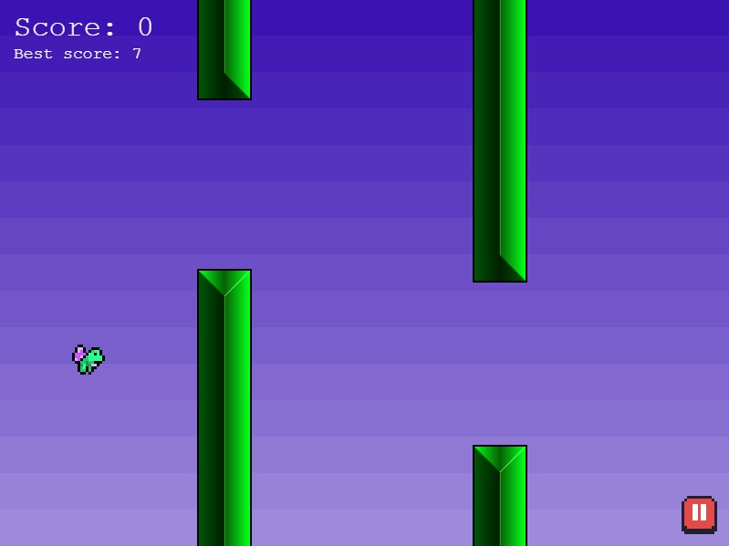

# Flappy Frog

Attempt to reproduce the game Flappy Bird, made with Phaser

Based on [The Phaser course](https://www.udemy.com/course/game-development-in-js-the-complete-guide-w-phaser-3/) by Filip Jerga with some updates



[Demo](https://leheen.github.io/flappy-frog/)

## Installation

```
nvm use
yarn install
```

## Launch

```
yarn dev
```

### Commands
<table>
    <tr>
        <td>Fly</td>
        <td>Space or left click</td>
    </tr>
    <tr>
        <td>Pause</td>
        <td>Escape</td>
    </tr>
</table>
